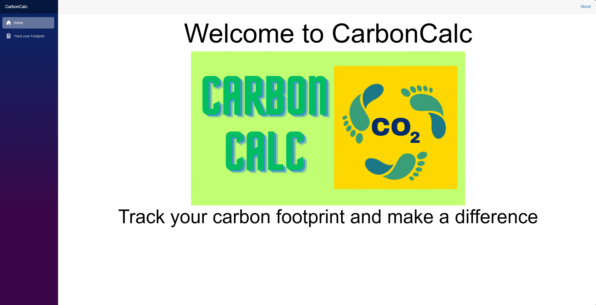
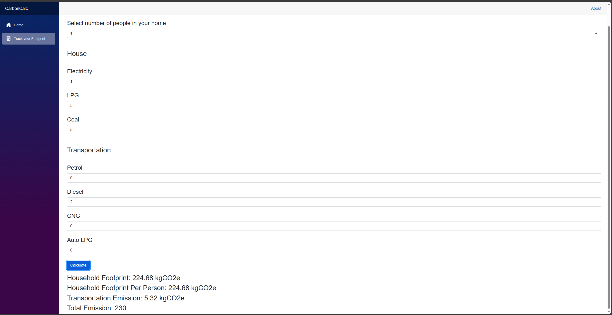

# CarbonCalc

# Introduction
CarbonCalc is a simple calculator that calculates the carbon footprint of a user based on their daily activities. The user can input the number of miles they drive, the number of hours they fly, and the number of hours they spend in a car. The calculator will then calculate the user's carbon footprint based on the average carbon emissions of these activities. The calculator also provides tips on how to reduce carbon emissions and live a more sustainable lifestyle.

# How it's built

This project is built using [Blazor](https://dotnet.microsoft.com/apps/aspnet/web-apps/blazor) and [ASP.NET](https://dotnet.microsoft.com/apps/aspnet). 

Blazor is a framework for building interactive client-side web UI with .NET. It allows developers to build full-stack web applications using C#, Razor, and HTML, all running in the browser via WebAssembly.

ASP.NET is a developer platform made up of tools, programming languages, and libraries for building many different types of applications. ASP.NET extends the .NET developer platform with tools and libraries specifically for building web apps.

# Screenshots

